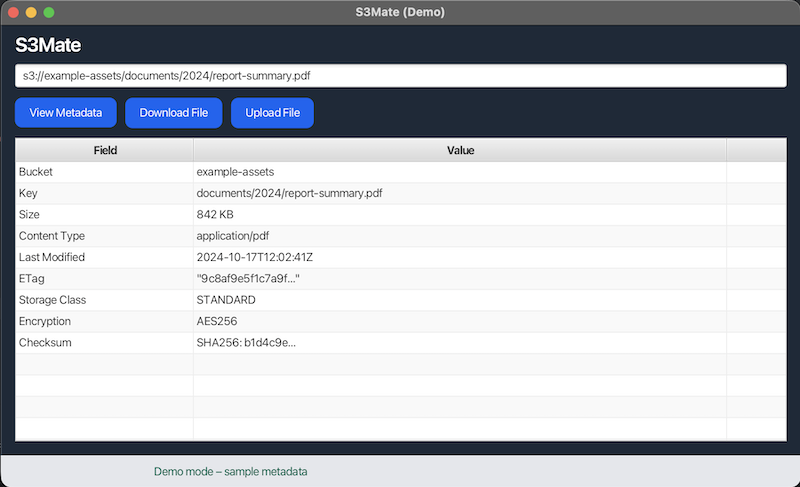

# S3Mate
Java gadget for easy access to AWS S3

## Overview
S3Mate is a lightweight JavaFX desktop application that allows you to quickly check, download, and upload objects in Amazon S3.

It is designed for developers and operators who want a simple GUI tool without installing heavy AWS consoles or browser-based tools.



## Features
- Supports all common S3 path formats
- View object metadata
- Download S3 objects
- Upload local files to S3 paths
- Uses standard AWS credential resolution
- Single runnable fat JAR

## Requirements
- Java **21** or later
- Valid AWS credentials

## Build and Run

Run By Gradle: `./gradlew clean run`

Build Fat JAR By Gradle: `./gradlew clean build`

Run Fat JAR:
```bash
java \
--module-path "$(./gradlew -q printJavafxModulePath)" \
--add-modules javafx.controls,javafx.fxml \
-jar build/libs/s3mate-SNAPSHOT-all.jar
```

Build MacOS specific package: `./gradlew clean jpackageMac`
and the package is located at `build/jpackage/mac/S3Mate.app`

Build Windows specific package: `./gradlew clean jpackageWin`
and the package is located at `build/jpackage/win/S3Mate.exe`

Build Linux specific package: `./gradlew clean jpackageLin`
and the package is located at `build/jpackage/linux/S3Mate/bin/S3Mate`

## Authors
- Teki Chan *tekichan@gmail.com*
